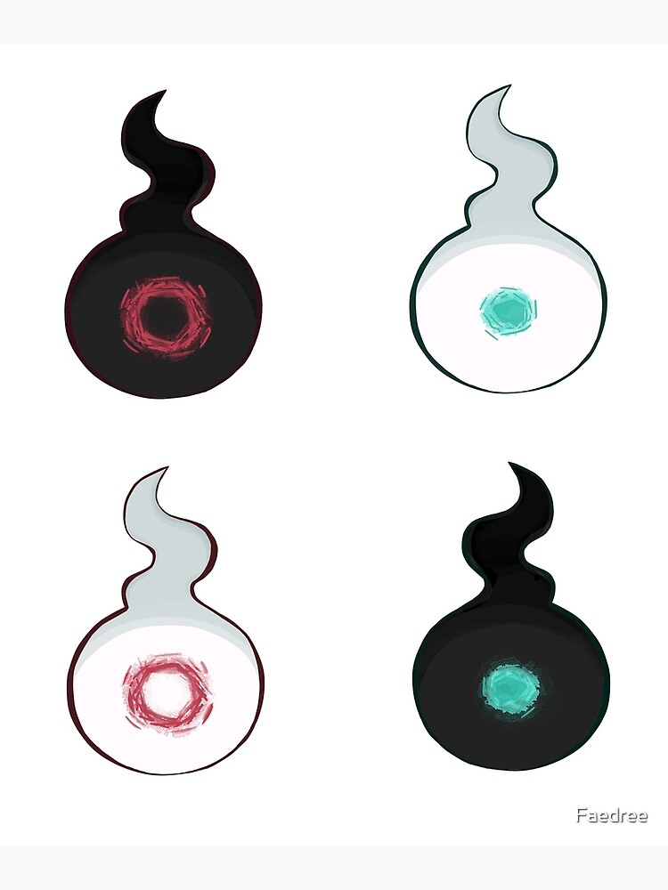
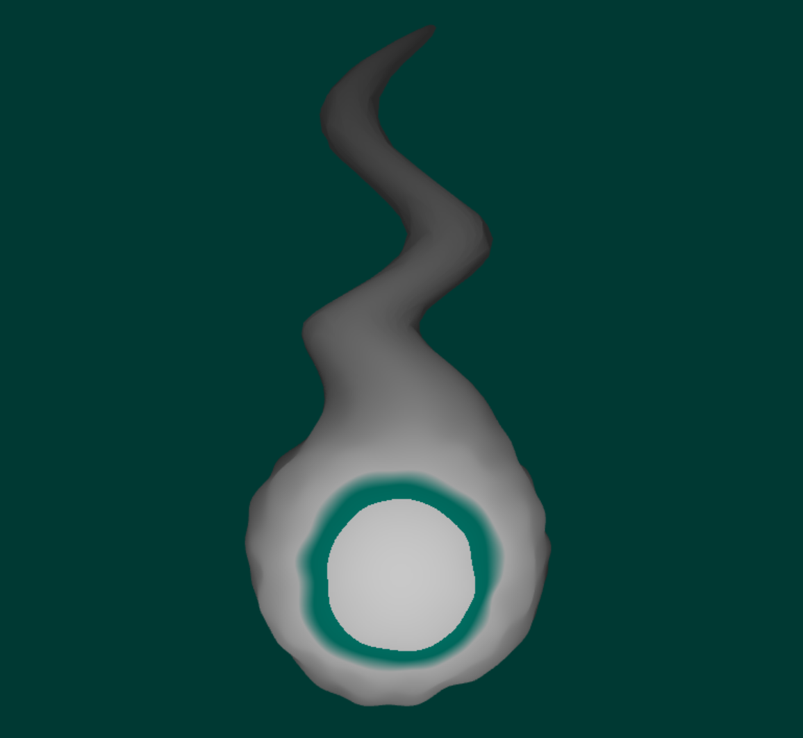
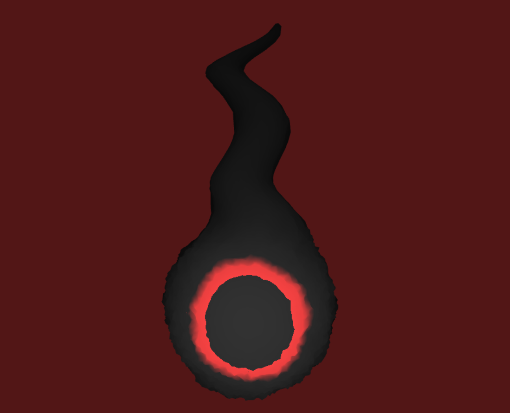

# [Project 1: Noise](https://github.com/CIS-566-Fall-2022/hw01-fireball-base)

## Submission Description (Charles Wang)

**Demo link: [https://aczw.github.io/hw01-fireball/](https://aczw.github.io/hw01-fireball/)**

For this homework, I chose to interpret the idea of a "fireball" as the floating Hakujoudai and Kokujoudai
found in the manga "Jibaku Shounen Hanako-kun." Here are some reference images I used (and so you know what
I'm even talking about):

And here's the end result:

### Vertex shader

Uses trigonometric functions for the base and then adds FBM on top to give the surface some detailed
variety. To get the "tail" I use the dot product between the vertex normal and a hardcoded (0, 1, 0)
to vary the height at that location. Vertex positions are displaced over time, and the tail is
animated using another trigonometric function.

### Fragment shader

The fireball is made up of two primary colors. Lambert shading is calculated by taking the dot product
of the surface normal with the camera direction, so the geometry facing the screen is always lit up.
The glowing ring expands and shrinks in size over time, and I use a sawtooth function to make it
pulse its color. I also smoothly interpolate the outer edge of the ring, giving us a gradient.

### GUI

- Adjust the two colors
- Change speed of tail animation
- Change the number of octaves for generating the FBM noise
- Two presets matching the designs from the manga
- Reset the camera position to the best view
